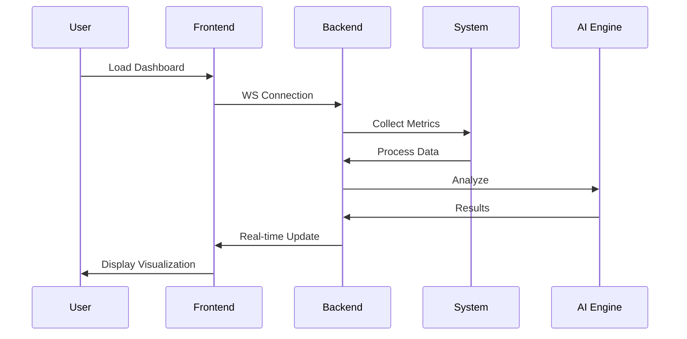

# AI-Powered Performance Analyzer for OS Processes

## Project Overview
The **AI-Powered Performance Analyzer** is a real-time system monitoring tool that uses machine learning to analyze OS processes, detect anomalies, and forecast resource usage. Designed with an interactive dashboard, it helps users identify performance bottlenecks, optimize system efficiency, and predict future trends.

---

## ⚙️ Key Features

### 1. Real-Time Process Monitoring
- Collects CPU, memory, disk I/O, and network usage metrics
- Tracks all running processes with detailed metrics

### 2. AI-Powered Analysis
- **Anomaly Detection** using Isolation Forest
- **Bottleneck Identification** for CPU, memory, disk
- **Resource Forecasting** using LSTM neural networks

### 3. Interactive Dashboard
- Live charts using Chart.js
- Real-time alerts for unusual activity
- Suggestions for system optimization

### 4. Web-Based Interface
- Built with Flask (Python backend) + HTML/CSS/JS frontend
- Real-time updates via WebSocket
- Responsive design for desktop/mobile

---

## 🧱 Technologies Used

### 💻 Programming Languages
- Python
- HTML, CSS, JavaScript

### 📦 Libraries and Tools
- `psutil` – for system monitoring
- `scikit-learn` – for Isolation Forest anomaly detection
- `TensorFlow / Keras` – for LSTM forecasting
- `Flask` + `Flask-SocketIO` – backend
- `Chart.js` – live visualization

### 🛠️ Other Tools
- GitHub – version control
- Google Colab – development & execution

---

## 🔁 GitHub Workflow
- Repository: `ai-performance-analyzer`
- Public repository: [GitHub Link](https://github.com/sudhanshu-079/ai-performance-analyzer)
- Maintains **7+ commits** with clear commit messages
- Uses branches for features and merges after testing
- Properly documented `README.md`

---

## 🔄 System Workflow Diagram



---

 Sample AI Code

### Anomaly Detection
```python
from sklearn.ensemble import IsolationForest
model = IsolationForest(contamination=0.05)
anomalies = model.fit_predict(features)
```

### Resource Forecasting with LSTM
```python
model = Sequential([
    LSTM(64, input_shape=(60, 5)),
    Dense(1)
])
model.compile(optimizer='adam', loss='mse')
```

---

## 📈 Sample Dashboard Output
| Metric             | Value              |
|--------------------|--------------------|
| CPU Usage          | 78% (High)         |
| Memory Available   | 1.2 GB             |
| Top Process        | chrome.exe         |
| Detected Anomaly   | python.exe (spike) |

---

## ✅ Benefits
- **Proactive Monitoring** – Avoids system slowdowns
- **AI Insights** – Smarter than standard task managers
- **Forecasting** – Plan resource upgrades
- **User-Friendly** – Works without terminal knowledge

---

## 🔮 Future Scope
- Docker support for easier deployment
- Email alerts for anomalies
- Dashboard-based process termination
- Historical performance logs

---

## 📚 References
- [psutil Docs](https://psutil.readthedocs.io/)
- [scikit-learn Isolation Forest](https://scikit-learn.org/stable/modules/generated/sklearn.ensemble.IsolationForest.html)
- [TensorFlow LSTM](https://www.tensorflow.org/api_docs/python/tf/keras/layers/LSTM)
- [Chart.js](https://www.chartjs.org/)

---

## 👨‍💻 Author
**Sudhanshu**  
`AI-Powered Performance Analyzer Project`  
*College Project Submission 2025*

